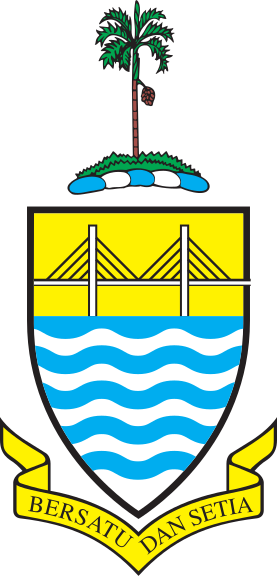

# PythonCFA

Welcome to the Penang Science Cluster's Coding for All project page for Python (PythonCFA).

Here you will find course material and coding samples that can be used in your class if you are a teacher, or for self-studying if you are an independent learner.

All material contained within are freely available under the GNU AFFERO GPL v3 license, with the exception of submodules we have attached to this repository for easy use and attribution.

# Sponsors

We would like to thank our main sponsor, the Penang State Government for funding the work in this project to make learning to code more accessible to everyone.

